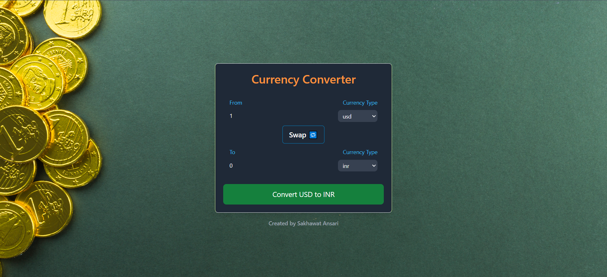

# Currency Converter

This is a simple currency converter application built with React and Tailwind CSS.

## Create Components
Here i can create a custom hook, using callback to use API and hold to res.json.
- create component folder and there create a index.js for import and export the InputBox.
- create InputBox.jsx file to add functions,level property

## Snapshot of currency converter

### Created by Sakhawat Ansari
