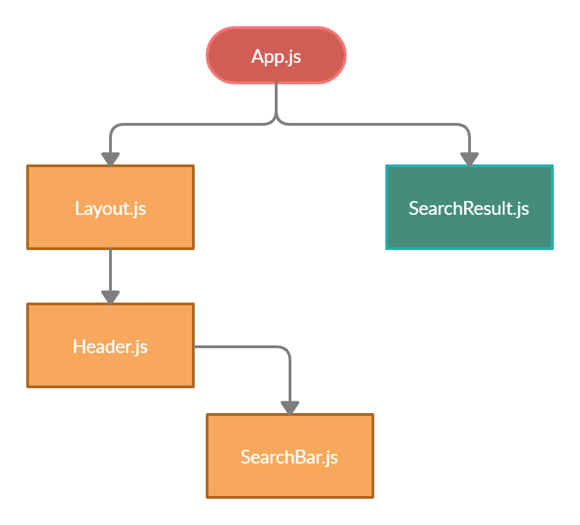
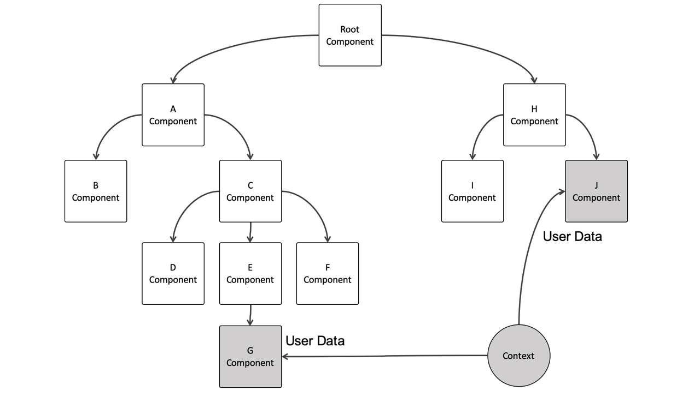

# useContext

`useContext` is a React Hook that lets you read and subscribe to context from your component.

```bash
const value = useContext(SomeContext)
```

## What is Context API?
Context API is used to pass global variables anywhere in the code. It helps when there is a need for sharing state between a lot of nested components. It is light in weight and easier to use, to create a context just need to call React.createContext(). No need to install other dependencies or third-party libraries like redux for state management.

- __inSimpleWord__ : The Context API in React allows for global state management without prop drilling.

- __Prop driling__ : Prop drilling in React refers to the process of passing data from a parent component to deeply nested child components through multiple intermediary components, even if those intermediaries don’t need the data. This can make the code harder to maintain and understand.


## Why is context API used?
Context API solves the problem of prop drilling in React. Prop Drilling occurs when data is to be passed between multiple layers before finally sending it to the required component. This makes the application slower. This problem is solved by Context API as it creates global variables to be used throughout the application without any middle components involved.It is also easier to use than React Redux


## For better understanding see diagram -


## Another diagram


## API Reference
- [React.dev](https://react.dev/reference/react/useContext)

- [GeeksforGeek](https://www.geeksforgeeks.org/explain-new-context-api-in-react/)
